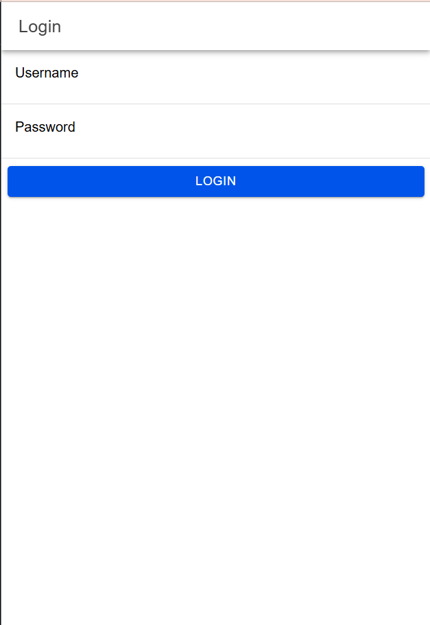
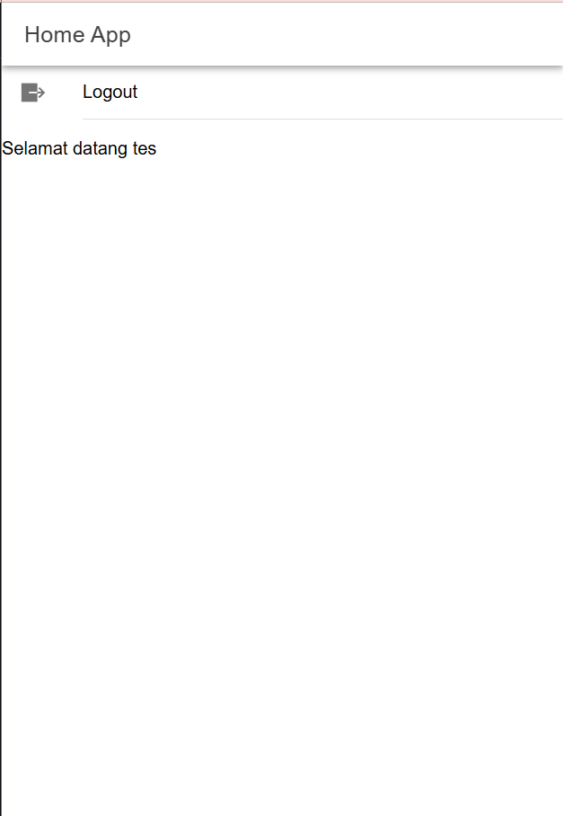

# Tugas 7
Nama       : Zia Khusnul Fauzi Akhmad

NIM        : H1D022023

Shift Baru : Shift D

Ini adalah aplikasi login yang dibangun menggunakan Angular dan Ionic. Berikut adalah bagian-bagian penting dari kode dalam proyek ini.

## Screenshot
### Login page

### Home page

## Class Penting

### `AuthenticationService`

Class ini menangani logika autentikasi seperti menyimpan dan menghapus data pengguna, membuat permintaan HTTP untuk login, dan mengelola status autentikasi.

Metode utama:
- `saveData(token: string, user: any)`: Menyimpan token autentikasi dan data pengguna.
- `clearData()`: Menghapus token autentikasi dan data pengguna.
- `postMethod(data: any, link: any)`: Melakukan permintaan POST ke tautan yang ditentukan dengan data yang diberikan.
- `notifikasi(pesan: string)`: Menampilkan notifikasi dengan pesan yang diberikan.
- `apiURL()`: Mengembalikan URL dasar untuk API.
- `logout()`: Melakukan logout pengguna dan menghapus status autentikasi.

### `LoginPage`

Class ini menangani formulir login dan autentikasi pengguna.

Metode utama:
- `ngOnInit()`: Lifecycle hook yang dipanggil setelah Angular menginisialisasi semua properti yang terikat data.
- `login()`: Menangani proses login dengan memvalidasi input, melakukan permintaan POST ke API login, dan mengarahkan ke halaman home jika login berhasil.

### `authGuard`

Class ini melindungi rute agar tidak dapat diakses oleh pengguna yang belum terautentikasi.

Logika utama:
- Guard ini memeriksa `authenticationState` dari `AuthenticationService` dan mengizinkan akses jika pengguna terautentikasi. Jika tidak, guard akan mengarahkan pengguna ke halaman login.

### `autoLoginGuard`

Class ini secara otomatis mengarahkan pengguna ke halaman home jika mereka sudah terautentikasi.

Logika utama:
- Guard ini memeriksa `authenticationState` dari `AuthenticationService` dan mengarahkan pengguna yang terautentikasi ke halaman home.
